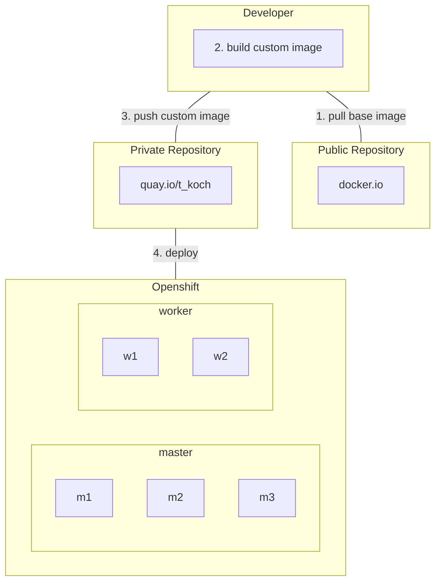

# Bechtle Misc
## Flowchart

## Instructions
```
podman login -u t_koch quay.io
podman build -t bechtle-web
podman tag bechtle-web quay.io/t_koch/bechtle-web:v1.0
podman push quay.io/t_koch/bechtle-web:v1.0
```
