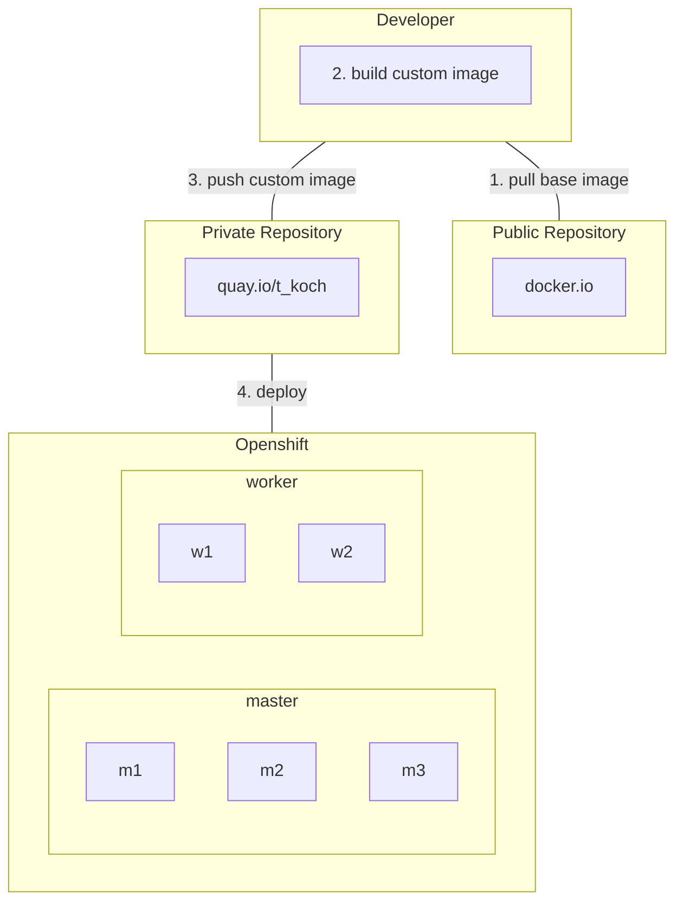
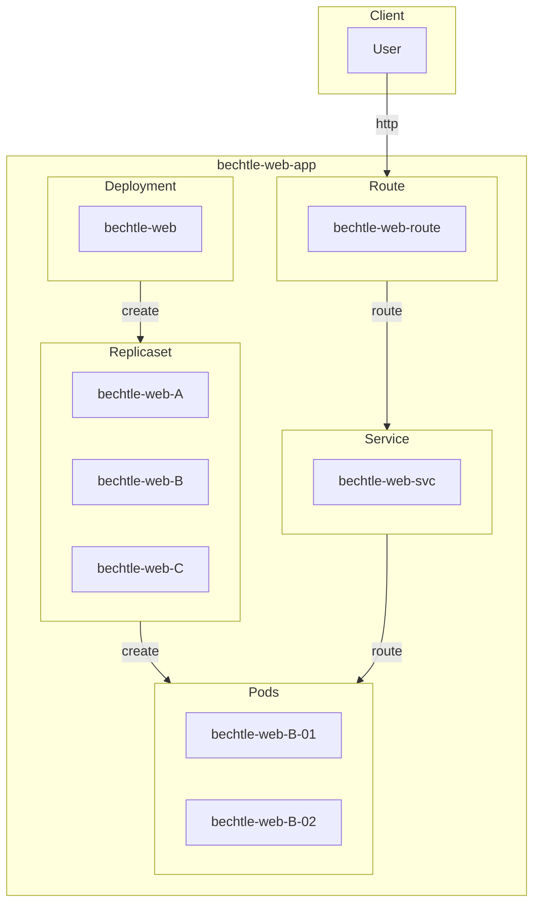

# Kubernetes / Openshift Deployment Example
## Flowchart Build Process


## Flowchart Deployment Resource


## Instructions
### Window 1
```
source vars
oc create ns $namespace
sh build.sh <version>
```
### Window 2
```
while true;do curl bechtle-web-route-bechtle.apps.tk.env.av360.org;sleep 1;done
```
### Window 3
```
watch oc get all -n $namespace
```
