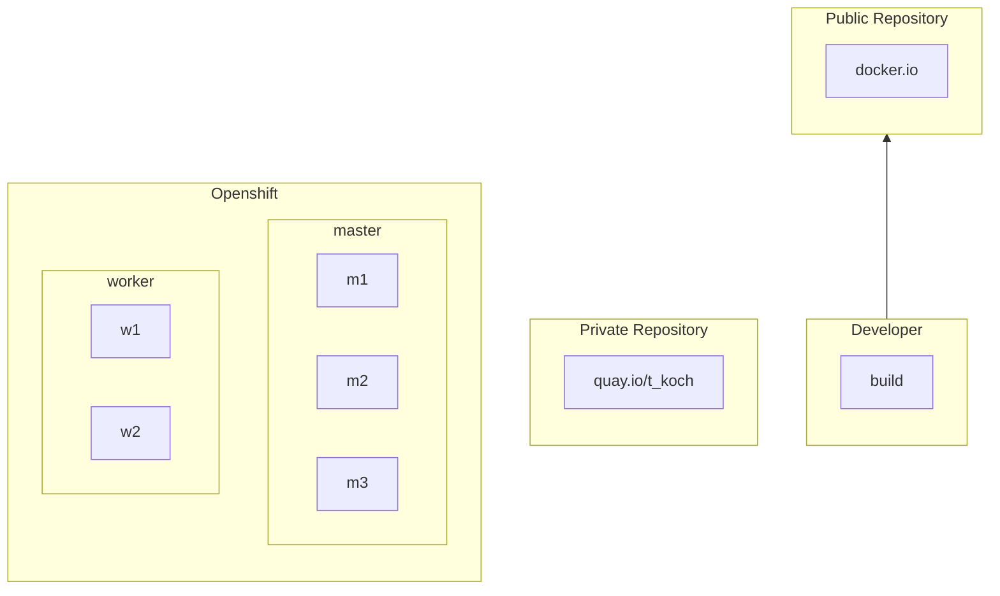

# Bechtle Misc
## Flowchart

```mermaid
graph BT
  subgraph dev1[Developer]
    build
  end
  subgraph pub1[Public Repository]
    docker[docker.io]
  end
  subgraph priv1[Private Repository]
    quay[quay.io/t_koch]
  end
  subgraph ocp1[Openshift]
    subgraph master
      m1;m2;m3
    end
    subgraph worker
      w1;w2
    end
  end
dev1 --> pub1
```
